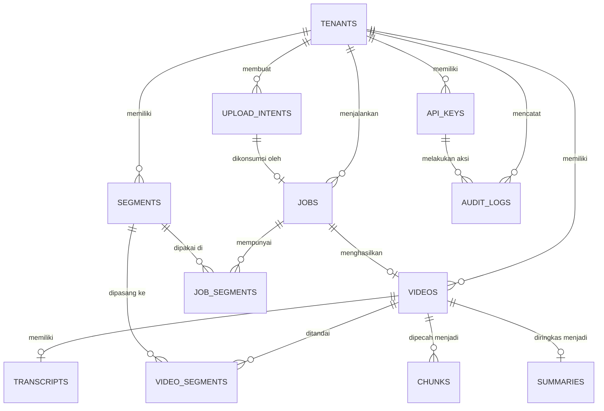

## Asumsi Teknis

Sebelum ERD, berikut asumsi yang diambil untuk menutup celah logika di PRD:

1. **Tabel `videos` merepresentasikan semua materi** — baik video, audio, maupun PDF. Kolom `kind` membedakan ketiganya. Nama tabel tetap `videos` karena PRD/FR-015 memakai resource `/videos/{id}`.
2. **Satu job memproses satu materi** (`videos.job_id` UNIQUE). `videos` dibuat oleh worker saat job mulai diproses, dengan status internal `processing` → `completed`/`failed`. Hanya video ber-status `completed` dan `deleted_at IS NULL` yang muncul di query RAG.
3. **Segmen bersifat tag many-to-many di level materi, bukan per chunk.** Chunk tidak memiliki `segment_id`. Filter segmen dilakukan melalui join `chunks → videos → video_segments → segments`.
4. **Segmen yang dikirim saat `POST /jobs` disimpan sementara di tabel `job_segments`**, karena `videos` belum ada saat job dibuat. Saat worker membuat `videos`, data disalin ke `video_segments`.
5. **Embedding BGE-M3 disimpan sebagai dense vector 1024 dimensi** (`vector(1024)`). Jika implementasi Cloudflare AI menghasilkan dimensi berbeda, cukup jalankan migration tambahan.
6. **`api_keys` tidak memakai Row Level Security**, karena lookup key dilakukan berdasarkan `key_hash` sebelum `tenant_id` diketahui. Akses ke tabel ini dibatasi hanya dari server internal. Tabel data tenant tetap memakai RLS.
7. **`upload_intents` punya status `issued` → `consumed`**, dengan `expires_at` dan `consumed_at`. Ini mencegah pemakaian ganda presigned URL.
8. **Soft delete video memakai `deleted_at`.** Data transkrip, chunk, dan summary tetap permanen di database sesuai FR-017.
9. **Transkrip disimpan terpisah di tabel `transcripts`** agar query metadata video tidak ikut membaca teks besar.
10. **Tidak ada tabel user/participant**, karena PII siswa berada di luar scope.
11. **`audit_logs` dibuat minimal untuk aksi mutasi** sesuai threat #8 (upload intent, create job, delete video). Isi pertanyaan query tidak disimpan.
12. **`jobs.upload_intent_id` UNIQUE**, karena satu upload intent hanya bisa menghasilkan satu job.

---

## ERD — Mermaid.js



---

## Penjelasan Detail Tabel & Kolom

### 1. Tabel `tenants`

Tabel master tenant B2B.

| Kolom | Tipe | Constraint / Default | Keterangan |
|---|---|---|---|
| `id` | `uuid` | PK, default `gen_random_uuid()` | ID unik tenant. |
| `name` | `text` | NOT NULL | Nama tenant/klien. |
| `slug` | `text` | NOT NULL, UNIQUE | Slug unik untuk identifikasi tenant. |
| `created_at` | `timestamptz` | NOT NULL, default `now()` | Waktu tenant dibuat. |
| `updated_at` | `timestamptz` | NOT NULL, default `now()` | Waktu update terakhir. |

**Index:** `UNIQUE(slug)`  
**RLS:** Tidak diaktifkan — akses internal server.

---

### 2. Tabel `api_keys`

API key untuk autentikasi server-to-server.

| Kolom | Tipe | Constraint / Default | Keterangan |
|---|---|---|---|
| `id` | `uuid` | PK, default `gen_random_uuid()` | ID API key. |
| `tenant_id` | `uuid` | FK → `tenants.id`, NOT NULL | Tenant pemilik key. |
| `name` | `text` | NOT NULL | Label key, misal `admin-prod`, `query-demo`. |
| `key_hash` | `char(64)` | NOT NULL, UNIQUE | SHA-256 hex dari plaintext API key. Plaintext tidak disimpan. |
| `scope` | `text` | NOT NULL, CHECK (`admin`, `query`) | Hak akses key. |
| `revoked_at` | `timestamptz` | NULL | Jika terisi, key tidak berlaku lagi. |
| `last_used_at` | `timestamptz` | NULL | Terakhir kali key dipakai. |
| `created_at` | `timestamptz` | NOT NULL, default `now()` | Waktu key dibuat. |
| `updated_at` | `timestamptz` | NOT NULL, default `now()` | Waktu update terakhir. |

**Index:**
- `UNIQUE(key_hash)` — lookup by hash.
- `(tenant_id)` — list key per tenant.

**RLS:** Tidak diaktifkan. Lookup `key_hash` dilakukan oleh server sebelum `tenant_id` diketahui.

---

### 3. Tabel `upload_intents`

Mencatat intent upload dan presigned URL yang diterbitkan.

| Kolom | Tipe | Constraint / Default | Keterangan |
|---|---|---|---|
| `id` | `uuid` | PK, default `gen_random_uuid()` | ID upload intent; dipakai sebagai `job_uuid` di object key R2. |
| `tenant_id` | `uuid` | FK → `tenants.id`, NOT NULL | Tenant pemilik. |
| `file_key` | `text` | NOT NULL, UNIQUE | Object key R2, pola `{tenant_id}/{id}/{uuid}.{ext}`. |
| `content_type` | `text` | NOT NULL | MIME type yang diizinkan, misal `video/mp4`, `audio/mpeg`, `application/pdf`. |
| `status` | `text` | NOT NULL, default `issued`, CHECK (`issued`, `consumed`) | Status intent. |
| `expires_at` | `timestamptz` | NOT NULL | Waktu kedaluwarsa presigned URL (5–10 menit). |
| `consumed_at` | `timestamptz` | NULL | Waktu intent dipakai oleh job; mencegah reuse. |
| `created_at` | `timestamptz` | NOT NULL, default `now()` | Waktu intent dibuat. |

**Index:**
- `UNIQUE(file_key)`
- `(tenant_id, expires_at)` — lookup intent aktif per tenant.

**RLS:** Aktif.

---

### 4. Tabel `jobs`

Job pipeline pemrosesan materi.

| Kolom | Tipe | Constraint / Default | Keterangan |
|---|---|---|---|
| `id` | `uuid` | PK, default `gen_random_uuid()` | ID job; dikirim ke worker via `pg_notify`. |
| `tenant_id` | `uuid` | FK → `tenants.id`, NOT NULL | Tenant pemilik job. |
| `upload_intent_id` | `uuid` | FK → `upload_intents.id`, UNIQUE, NULL | Upload intent asal. NULL jika intent dihapus. |
| `file_key` | `text` | NOT NULL, UNIQUE | Object key R2 yang akan diproses. |
| `title` | `text` | NOT NULL | Judul materi dari admin. |
| `kind` | `text` | NOT NULL, CHECK (`video`, `audio`, `pdf`) | Jenis materi; menentukan pipeline Whisper vs LlamaParse. |
| `status` | `text` | NOT NULL, default `pending`, CHECK (`pending`, `processing`, `completed`, `failed`) | Status job. |
| `stage` | `text` | NOT NULL, default `queued` | Tahap pipeline: `queued`, `downloading`, `transcribing`, `parsing`, `chunking`, `embedding`, `summarizing`, `completed`. |
| `error_message` | `text` | NULL | Pesan error saat job gagal. |
| `retry_count` | `integer` | NOT NULL, default `0` | Jumlah percobaan ulang. |
| `started_at` | `timestamptz` | NULL | Waktu worker pertama kali claim job. |
| `finished_at` | `timestamptz` | NULL | Waktu job mencapai `completed`/`failed`. |
| `created_at` | `timestamptz` | NOT NULL, default `now()` | Waktu job dibuat. |
| `updated_at` | `timestamptz` | NOT NULL, default `now()` | Waktu update terakhir. |

**Index:**
- `(status, created_at)` — polling antrian dengan `FOR UPDATE SKIP LOCKED`.
- `(tenant_id, created_at)` — list job untuk admin.
- `UNIQUE(file_key)`
- `UNIQUE(upload_intent_id)`

**Trigger:** `AFTER INSERT` melakukan `pg_notify('job_created', id)` ke worker.  
**RLS:** Aktif.

---

### 5. Tabel `segments`

Tag/segmen flat yang melekat ke materi.

| Kolom | Tipe | Constraint / Default | Keterangan |
|---|---|---|---|
| `id` | `uuid` | PK, default `gen_random_uuid()` | ID segmen. |
| `tenant_id` | `uuid` | FK → `tenants.id`, NOT NULL | Tenant pemilik segmen. |
| `name` | `text` | NOT NULL | Nama segmen, misal `web desain`, `html dasar`. |
| `created_at` | `timestamptz` | NOT NULL, default `now()` | Waktu segmen dibuat. |

**Index:** `UNIQUE(tenant_id, lower(name))` — nama segmen unik per tenant secara case-insensitive.  
**RLS:** Aktif.

---

### 6. Tabel `job_segments`

Menyimpan segmen yang dikirim admin saat `POST /jobs`, sebelum `videos` lahir.

| Kolom | Tipe | Constraint / Default | Keterangan |
|---|---|---|---|
| `job_id` | `uuid` | PK/FK → `jobs.id`, ON DELETE CASCADE | Job terkait. |
| `segment_id` | `uuid` | PK/FK → `segments.id`, ON DELETE RESTRICT | Segmen terkait. |
| `tenant_id` | `uuid` | FK → `tenants.id`, NOT NULL | Redundan untuk RLS dan indeks filter. |

**Index:**
- `(tenant_id, segment_id)` — filter job berdasarkan segmen.
- `(segment_id)` — lookup kebalikan.

**RLS:** Aktif.

---

### 7. Tabel `videos`

Materi kursus hasil pemrosesan job.

| Kolom | Tipe | Constraint / Default | Keterangan |
|---|---|---|---|
| `id` | `uuid` | PK, default `gen_random_uuid()` | ID materi. |
| `tenant_id` | `uuid` | FK → `tenants.id`, NOT NULL | Tenant pemilik. |
| `job_id` | `uuid` | FK → `jobs.id`, NOT NULL, UNIQUE | Job asal materi. |
| `title` | `text` | NOT NULL | Judul materi. |
| `kind` | `text` | NOT NULL, CHECK (`video`, `audio`, `pdf`) | Jenis materi. |
| `file_key` | `text` | NOT NULL, UNIQUE | Object key R2. |
| `status` | `text` | NOT NULL, default `processing`, CHECK (`processing`, `completed`, `failed`) | Status materi. Hanya `completed` yang dipakai query RAG. |
| `duration_seconds` | `integer` | NULL, CHECK (`> 0`) | Durasi video/audio jika tersedia. |
| `deleted_at` | `timestamptz` | NULL | Soft delete; `NULL` berarti aktif. |
| `created_at` | `timestamptz` | NOT NULL, default `now()` | Waktu materi dibuat. |
| `updated_at` | `timestamptz` | NOT NULL, default `now()` | Waktu update terakhir. |

**Index:**
- `(tenant_id, status, deleted_at)` — query materi aktif per tenant.
- `UNIQUE(job_id)`
- `UNIQUE(file_key)`

**RLS:** Aktif.

---

### 8. Tabel `video_segments`

Relasi many-to-many antara materi dan segmen.

| Kolom | Tipe | Constraint / Default | Keterangan |
|---|---|---|---|
| `video_id` | `uuid` | PK/FK → `videos.id`, ON DELETE CASCADE | Video terkait. |
| `segment_id` | `uuid` | PK/FK → `segments.id`, ON DELETE RESTRICT | Segmen terkait. |
| `tenant_id` | `uuid` | FK → `tenants.id`, NOT NULL | Redundan untuk RLS dan index `(tenant_id, segment_id)`. |

**Index:**
- `(tenant_id, segment_id)` — sesuai SR-01, mempercepat filter segmen saat vector search.
- `(segment_id)` — lookup kebalikan.

**RLS:** Aktif.

---

### 9. Tabel `transcripts`

Transkrip lengkap hasil Whisper / LlamaParse.

| Kolom | Tipe | Constraint / Default | Keterangan |
|---|---|---|---|
| `id` | `uuid` | PK, default `gen_random_uuid()` | ID transkrip. |
| `tenant_id` | `uuid` | FK → `tenants.id`, NOT NULL | Tenant pemilik. |
| `video_id` | `uuid` | FK → `videos.id`, NOT NULL, UNIQUE | Relasi 1:1 dengan video. |
| `content` | `text` | NOT NULL | Teks transkrip lengkap. |
| `language` | `text` | NULL | Bahasa dominan hasil deteksi model. |
| `model` | `text` | NULL | Model transkrip, misal `whisper-large-v3`. |
| `created_at` | `timestamptz` | NOT NULL, default `now()` | Waktu transkrip dibuat. |

**Index:** `(tenant_id, video_id)` selain UNIQUE `video_id`.  
**RLS:** Aktif.

---

### 10. Tabel `chunks`

Potongan teks hasil chunking, lengkap dengan embedding vektor.

| Kolom | Tipe | Constraint / Default | Keterangan |
|---|---|---|---|
| `id` | `uuid` | PK, default `gen_random_uuid()` | ID chunk. |
| `tenant_id` | `uuid` | FK → `tenants.id`, NOT NULL | Tenant pemilik. |
| `video_id` | `uuid` | FK → `videos.id`, ON DELETE CASCADE | Video asal chunk. |
| `chunk_index` | `integer` | NOT NULL | Urutan chunk dalam video. |
| `content` | `text` | NOT NULL | Potongan 3–4 kalimat, overlap 1–2 kalimat. |
| `embedding` | `vector(1024)` | NOT NULL | Dense vector BGE-M3. |
| `created_at` | `timestamptz` | NOT NULL, default `now()` | Waktu chunk dibuat. |

**Index:**
- `(tenant_id, video_id)` — filter tenant/video.
- `UNIQUE(video_id, chunk_index)` — mencegah duplikasi urutan.
- `USING hnsw (embedding vector_cosine_ops)` — similarity search.

**RLS:** Aktif.

---

### 11. Tabel `summaries`

Ringkasan per video, maksimal 1 baris per video.

| Kolom | Tipe | Constraint / Default | Keterangan |
|---|---|---|---|
| `id` | `uuid` | PK, default `gen_random_uuid()` | ID summary. |
| `tenant_id` | `uuid` | FK → `tenants.id`, NOT NULL | Tenant pemilik. |
| `video_id` | `uuid` | FK → `videos.id`, NOT NULL, UNIQUE | Video terkait. |
| `status` | `text` | NOT NULL, default `pending`, CHECK (`pending`, `completed`, `failed`) | Status pembuatan summary. |
| `content` | `text` | NULL | Isi summary; terisi saat `completed`. |
| `language` | `text` | NULL | Bahasa summary. |
| `model` | `text` | NULL | Model LLM, misal DeepSeek. |
| `error_message` | `text` | NULL | Error saat `failed`; dipakai untuk retry summary saja. |
| `created_at` | `timestamptz` | NOT NULL, default `now()` | Waktu dibuat. |
| `updated_at` | `timestamptz` | NOT NULL, default `now()` | Waktu update. |

**Index:** `(tenant_id, video_id)` selain UNIQUE `video_id`.  
**RLS:** Aktif.

---

### 12. Tabel `audit_logs`

Audit trail aksi mutasi penting.

| Kolom | Tipe | Constraint / Default | Keterangan |
|---|---|---|---|
| `id` | `uuid` | PK, default `gen_random_uuid()` | ID log. |
| `tenant_id` | `uuid` | FK → `tenants.id`, NOT NULL | Tenant tempat aksi terjadi. |
| `actor_key_id` | `uuid` | FK → `api_keys.id`, ON DELETE SET NULL, NULL | API key pelaku; NULL untuk aksi sistem/manual. |
| `action` | `text` | NOT NULL | Nama aksi, misal `upload_intent.create`, `job.create`, `video.delete`. |
| `object_id` | `uuid` | NULL | ID objek yang dimutasi. |
| `metadata` | `jsonb` | NOT NULL, default `{}` | Data tambahan, misal daftar segmen atau alasan. |
| `created_at` | `timestamptz` | NOT NULL, default `now()` | Waktu aksi. |

**Index:**
- `(tenant_id, created_at)` — riwayat per tenant.
- `(actor_key_id)` — riwayat per API key.

**RLS:** Tidak diaktifkan — akses internal server.

---

## Lampiran: Migration SQL (goose + sqlc)

Migration awal `001_init.up.sql`:

```sql
-- 001_init.up.sql

CREATE EXTENSION IF NOT EXISTS vector;
CREATE EXTENSION IF NOT EXISTS pgcrypto;

-- Helper untuk updated_at
CREATE OR REPLACE FUNCTION set_updated_at()
RETURNS trigger AS $$
BEGIN
    NEW.updated_at = now();
    RETURN NEW;
END;
$$ LANGUAGE plpgsql;

-- ============ tenants ============
CREATE TABLE tenants (
    id uuid PRIMARY KEY DEFAULT gen_random_uuid(),
    name text NOT NULL,
    slug text NOT NULL UNIQUE,
    created_at timestamptz NOT NULL DEFAULT now(),
    updated_at timestamptz NOT NULL DEFAULT now()
);

CREATE TRIGGER trg_tenants_updated_at
BEFORE UPDATE ON tenants
FOR EACH ROW EXECUTE FUNCTION set_updated_at();

-- ============ api_keys ============
CREATE TABLE api_keys (
    id uuid PRIMARY KEY DEFAULT gen_random_uuid(),
    tenant_id uuid NOT NULL REFERENCES tenants(id) ON DELETE CASCADE,
    name text NOT NULL,
    key_hash char(64) NOT NULL UNIQUE,
    scope text NOT NULL CHECK (scope IN ('admin', 'query')),
    revoked_at timestamptz,
    last_used_at timestamptz,
    created_at timestamptz NOT NULL DEFAULT now(),
    updated_at timestamptz NOT NULL DEFAULT now()
);

CREATE INDEX api_keys_tenant_idx ON api_keys (tenant_id);

CREATE TRIGGER trg_api_keys_updated_at
BEFORE UPDATE ON api_keys
FOR EACH ROW EXECUTE FUNCTION set_updated_at();

-- ============ upload_intents ============
CREATE TABLE upload_intents (
    id uuid PRIMARY KEY DEFAULT gen_random_uuid(),
    tenant_id uuid NOT NULL REFERENCES tenants(id) ON DELETE CASCADE,
    file_key text NOT NULL UNIQUE,
    content_type text NOT NULL,
    status text NOT NULL DEFAULT 'issued' CHECK (status IN ('issued', 'consumed')),
    expires_at timestamptz NOT NULL,
    consumed_at timestamptz,
    created_at timestamptz NOT NULL DEFAULT now()
);

CREATE INDEX upload_intents_tenant_expires_idx ON upload_intents (tenant_id, expires_at);

-- ============ jobs ============
CREATE TABLE jobs (
    id uuid PRIMARY KEY DEFAULT gen_random_uuid(),
    tenant_id uuid NOT NULL REFERENCES tenants(id) ON DELETE CASCADE,
    upload_intent_id uuid UNIQUE REFERENCES upload_intents(id) ON DELETE SET NULL,
    file_key text NOT NULL UNIQUE,
    title text NOT NULL,
    kind text NOT NULL CHECK (kind IN ('video', 'audio', 'pdf')),
    status text NOT NULL DEFAULT 'pending' CHECK (status IN ('pending', 'processing', 'completed', 'failed')),
    stage text NOT NULL DEFAULT 'queued',
    error_message text,
    retry_count integer NOT NULL DEFAULT 0,
    started_at timestamptz,
    finished_at timestamptz,
    created_at timestamptz NOT NULL DEFAULT now(),
    updated_at timestamptz NOT NULL DEFAULT now()
);

CREATE INDEX jobs_status_created_idx ON jobs (status, created_at);
CREATE INDEX jobs_tenant_created_idx ON jobs (tenant_id, created_at);

CREATE TRIGGER trg_jobs_updated_at
BEFORE UPDATE ON jobs
FOR EACH ROW EXECUTE FUNCTION set_updated_at();

-- ============ segments ============
CREATE TABLE segments (
    id uuid PRIMARY KEY DEFAULT gen_random_uuid(),
    tenant_id uuid NOT NULL REFERENCES tenants(id) ON DELETE CASCADE,
    name text NOT NULL,
    created_at timestamptz NOT NULL DEFAULT now()
);

CREATE UNIQUE INDEX segments_tenant_lower_name_idx ON segments (tenant_id, lower(name));

-- ============ job_segments ============
CREATE TABLE job_segments (
    job_id uuid NOT NULL REFERENCES jobs(id) ON DELETE CASCADE,
    segment_id uuid NOT NULL REFERENCES segments(id) ON DELETE RESTRICT,
    tenant_id uuid NOT NULL REFERENCES tenants(id) ON DELETE CASCADE,
    PRIMARY KEY (job_id, segment_id)
);

CREATE INDEX job_segments_tenant_segment_idx ON job_segments (tenant_id, segment_id);
CREATE INDEX job_segments_segment_idx ON job_segments (segment_id);

-- ============ videos ============
CREATE TABLE videos (
    id uuid PRIMARY KEY DEFAULT gen_random_uuid(),
    tenant_id uuid NOT NULL REFERENCES tenants(id) ON DELETE CASCADE,
    job_id uuid NOT NULL UNIQUE REFERENCES jobs(id) ON DELETE RESTRICT,
    title text NOT NULL,
    kind text NOT NULL CHECK (kind IN ('video', 'audio', 'pdf')),
    file_key text NOT NULL UNIQUE,
    status text NOT NULL DEFAULT 'processing' CHECK (status IN ('processing', 'completed', 'failed')),
    duration_seconds integer CHECK (duration_seconds IS NULL OR duration_seconds > 0),
    deleted_at timestamptz,
    created_at timestamptz NOT NULL DEFAULT now(),
    updated_at timestamptz NOT NULL DEFAULT now()
);

CREATE INDEX videos_tenant_status_deleted_idx ON videos (tenant_id, status, deleted_at);

CREATE TRIGGER trg_videos_updated_at
BEFORE UPDATE ON videos
FOR EACH ROW EXECUTE FUNCTION set_updated_at();

-- ============ video_segments ============
CREATE TABLE video_segments (
    video_id uuid NOT NULL REFERENCES videos(id) ON DELETE CASCADE,
    segment_id uuid NOT NULL REFERENCES segments(id) ON DELETE RESTRICT,
    tenant_id uuid NOT NULL REFERENCES tenants(id) ON DELETE CASCADE,
    PRIMARY KEY (video_id, segment_id)
);

CREATE INDEX video_segments_tenant_segment_idx ON video_segments (tenant_id, segment_id);
CREATE INDEX video_segments_segment_idx ON video_segments (segment_id);

-- ============ transcripts ============
CREATE TABLE transcripts (
    id uuid PRIMARY KEY DEFAULT gen_random_uuid(),
    tenant_id uuid NOT NULL REFERENCES tenants(id) ON DELETE CASCADE,
    video_id uuid NOT NULL UNIQUE REFERENCES videos(id) ON DELETE CASCADE,
    content text NOT NULL,
    language text,
    model text,
    created_at timestamptz NOT NULL DEFAULT now()
);

CREATE INDEX transcripts_tenant_video_idx ON transcripts (tenant_id, video_id);

-- ============ chunks ============
CREATE TABLE chunks (
    id uuid PRIMARY KEY DEFAULT gen_random_uuid(),
    tenant_id uuid NOT NULL REFERENCES tenants(id) ON DELETE CASCADE,
    video_id uuid NOT NULL REFERENCES videos(id) ON DELETE CASCADE,
    chunk_index integer NOT NULL,
    content text NOT NULL,
    embedding vector(1024) NOT NULL,
    created_at timestamptz NOT NULL DEFAULT now(),
    CONSTRAINT chunks_video_chunk_unique UNIQUE (video_id, chunk_index)
);

CREATE INDEX chunks_tenant_video_idx ON chunks (tenant_id, video_id);
CREATE INDEX chunks_embedding_hnsw_idx ON chunks USING hnsw (embedding vector_cosine_ops);

-- ============ summaries ============
CREATE TABLE summaries (
    id uuid PRIMARY KEY DEFAULT gen_random_uuid(),
    tenant_id uuid NOT NULL REFERENCES tenants(id) ON DELETE CASCADE,
    video_id uuid NOT NULL UNIQUE REFERENCES videos(id) ON DELETE CASCADE,
    status text NOT NULL DEFAULT 'pending' CHECK (status IN ('pending', 'completed', 'failed')),
    content text,
    language text,
    model text,
    error_message text,
    created_at timestamptz NOT NULL DEFAULT now(),
    updated_at timestamptz NOT NULL DEFAULT now()
);

CREATE INDEX summaries_tenant_video_idx ON summaries (tenant_id, video_id);

CREATE TRIGGER trg_summaries_updated_at
BEFORE UPDATE ON summaries
FOR EACH ROW EXECUTE FUNCTION set_updated_at();

-- ============ audit_logs ============
CREATE TABLE audit_logs (
    id uuid PRIMARY KEY DEFAULT gen_random_uuid(),
    tenant_id uuid NOT NULL REFERENCES tenants(id) ON DELETE CASCADE,
    actor_key_id uuid REFERENCES api_keys(id) ON DELETE SET NULL,
    action text NOT NULL,
    object_id uuid,
    metadata jsonb NOT NULL DEFAULT '{}'::jsonb,
    created_at timestamptz NOT NULL DEFAULT now()
);

CREATE INDEX audit_logs_tenant_created_idx ON audit_logs (tenant_id, created_at);
CREATE INDEX audit_logs_actor_idx ON audit_logs (actor_key_id);

-- ============ notify job ============
CREATE OR REPLACE FUNCTION notify_job_created()
RETURNS trigger AS $$
BEGIN
    PERFORM pg_notify('job_created', NEW.id::text);
    RETURN NEW;
END;
$$ LANGUAGE plpgsql;

CREATE TRIGGER trg_jobs_notify
AFTER INSERT ON jobs
FOR EACH ROW EXECUTE FUNCTION notify_job_created();

-- ============ Row Level Security ============
ALTER TABLE upload_intents ENABLE ROW LEVEL SECURITY;
ALTER TABLE jobs ENABLE ROW LEVEL SECURITY;
ALTER TABLE segments ENABLE ROW LEVEL SECURITY;
ALTER TABLE job_segments ENABLE ROW LEVEL SECURITY;
ALTER TABLE videos ENABLE ROW LEVEL SECURITY;
ALTER TABLE video_segments ENABLE ROW LEVEL SECURITY;
ALTER TABLE transcripts ENABLE ROW LEVEL SECURITY;
ALTER TABLE chunks ENABLE ROW LEVEL SECURITY;
ALTER TABLE summaries ENABLE ROW LEVEL SECURITY;

CREATE POLICY upload_intents_isolation ON upload_intents
    USING (tenant_id = nullif(current_setting('app.tenant_id', true), '')::uuid)
    WITH CHECK (tenant_id = nullif(current_setting('app.tenant_id', true), '')::uuid);

CREATE POLICY jobs_isolation ON jobs
    USING (tenant_id = nullif(current_setting('app.tenant_id', true), '')::uuid)
    WITH CHECK (tenant_id = nullif(current_setting('app.tenant_id', true), '')::uuid);

CREATE POLICY segments_isolation ON segments
    USING (tenant_id = nullif(current_setting('app.tenant_id', true), '')::uuid)
    WITH CHECK (tenant_id = nullif(current_setting('app.tenant_id', true), '')::uuid);

CREATE POLICY job_segments_isolation ON job_segments
    USING (tenant_id = nullif(current_setting('app.tenant_id', true), '')::uuid)
    WITH CHECK (tenant_id = nullif(current_setting('app.tenant_id', true), '')::uuid);

CREATE POLICY videos_isolation ON videos
    USING (tenant_id = nullif(current_setting('app.tenant_id', true), '')::uuid)
    WITH CHECK (tenant_id = nullif(current_setting('app.tenant_id', true), '')::uuid);

CREATE POLICY video_segments_isolation ON video_segments
    USING (tenant_id = nullif(current_setting('app.tenant_id', true), '')::uuid)
    WITH CHECK (tenant_id = nullif(current_setting('app.tenant_id', true), '')::uuid);

CREATE POLICY transcripts_isolation ON transcripts
    USING (tenant_id = nullif(current_setting('app.tenant_id', true), '')::uuid)
    WITH CHECK (tenant_id = nullif(current_setting('app.tenant_id', true), '')::uuid);

CREATE POLICY chunks_isolation ON chunks
    USING (tenant_id = nullif(current_setting('app.tenant_id', true), '')::uuid)
    WITH CHECK (tenant_id = nullif(current_setting('app.tenant_id', true), '')::uuid);

CREATE POLICY summaries_isolation ON summaries
    USING (tenant_id = nullif(current_setting('app.tenant_id', true), '')::uuid)
    WITH CHECK (tenant_id = nullif(current_setting('app.tenant_id', true), '')::uuid);
```

---

## Catatan Implementasi untuk Agent Berikutnya

- Semua query sqlc yang menyentuh tabel data tenant **wajib** menyertakan `WHERE tenant_id = $1`.
- Middleware auth harus menjalankan `SELECT set_config('app.tenant_id', $1, true)` di awal transaksi agar RLS bekerja.
- Query RAG harus memfilter `videos.status = 'completed' AND videos.deleted_at IS NULL` agar materi gagal/dihapus tidak ikut ter-retrieve.
- Filter segmen pada vector search dilakukan dengan join/subquery ke `video_segments` + `segments`, bukan kolom `segment_id` di `chunks`.
- Worker harus idempoten: sebelum menulis ulang chunk/summary pada retry, hapus/update data lama berdasarkan `video_id`.